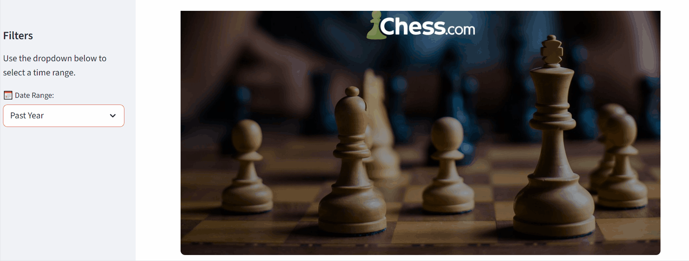

# ♟️ Chess Profile Analysis

A Streamlit dashboard that analyzes your chess.com games, visualizes your performance over time, and provides insights into your playing style.

---

## Features
- Total number of games analyzed  
- Rating progression over time  
- Win/Loss/Draw percentages  
- Average opponent rating by result  
- Average moves per result  

---

## Dashboard Preview
  

## Installation

1. Clone the repository:
   ```bash
   git clone git@github.com:SaeifEdd/Chess-Profile-Analysis-.git
   cd Chess-Profile-Analysis-
2. Install dependencies:
python -m venv venv
source venv/bin/activate   # On Linux/Mac
venv\Scripts\activate      # On Windows
pip install -r requirements.txt
3. Create a `.env` file in the project root and add your Chess.com credentials:
   ```env
   CUSERNAME=your_username
   CPASSWORD=your_password
4. Install Chrome and ChromeDriver
5. Run the pipeline:\
python extract.py   
python transform.py  
streamlit run chess_analysis.py

👤 Author

SaifEdd
📧 saeifchaabouni@gmail.com
